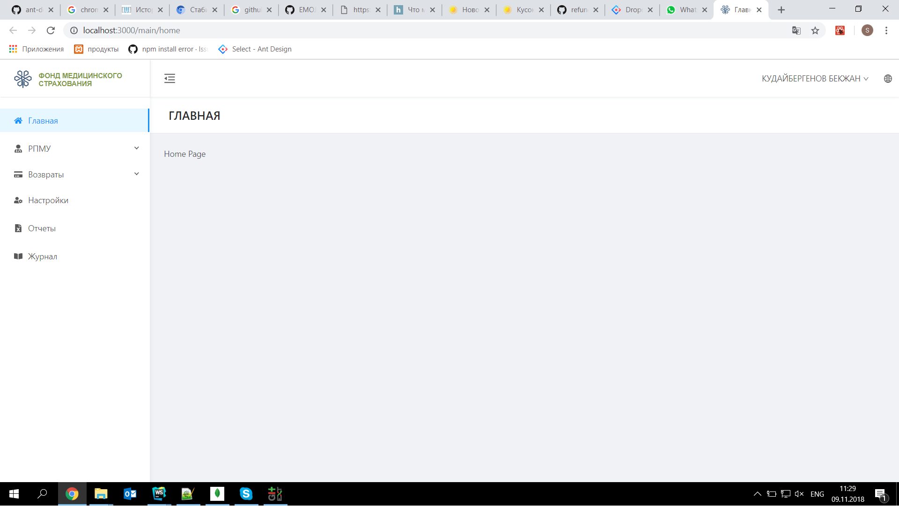

<h1 align="center">ИС Регистр Потребителей Медицинских Услуг</h1>

<div align="center">

Руководство для разработчика



</div>


## GET START

```bash
$ git clone https://github.com/refunddev/refund_app.git
$ cd refund-app
$ yarn(npm) install
$ yarn(npm) start         # visit http://localhost:8000
```

## Страницы

```
- Авторизация
  -  путь: '/user/login',             компонент: '.pages/User/Login'                        #Страница входа
- Главная
  -  путь: '/main/home',              компонент: '.pages/HomePage/HomePage'                 #Главная
- РПМУ
  -  путь: '/rpmu/payments',          компонент: '.pages/Payments/PaymentsPage'             #Платежи
  -  путь: '/rpmu/payments',          компонент: '.pages/SearchPhysical/Searcher'           #Поиск в ГБД ФЛ 
- Возвраты
  -  путь: '/refunds/requests',       компонент: '.pages/Requests/Requests',                #Заявки
  -  путь: '/refunds/reestr',         компонент: '.pages/Main/MainView',                    #Реестр возвратов
  -  путь: '/refunds/calendar',       компонент: '.pages/Calendar/CalendarView',            #Календарь
  -  путь: '/refunds/templates_view', компонент: '.pages/Templates/Template',               #Шаблон
  -  путь: '/refunds/stat',           компонент: '.pages/StaticticsView/StaticticsView',    #Статистические данные
- Настройки
  -  путь: '/options',                компонент: './Options/Options'                        #Настройки
- Отчет
  -  путь: '/reports',                компонент: './Reports/ReportsPage'                    #Отчет
- Журнал
  -  путь: '/journal',                компонент: './Journal/JournalPage'                    #Журнат
- Ошибки
  -  путь: '/exception/404',          компонент: '/Exception/404'                           #Ошибка 404
  -  путь: '/exception/403',          компонент: '/Exception/403'                           #Ошибка 403
  -  путь: '/exception/500',          компонент: '/Exception/500'                           #Ошибка 500
```

## Возможности

- :white_check_mark: **Дизайн**: Разработано с использованием библиотеки компонентов Ant Design [спецификация Ant Design](http://ant.design/)
- :white_check_mark: **Страницы**: Все страницы и компоненты имеют общий родитель (общий стиль и размер и дизайн)
- :white_check_mark: **Стэк технологий**: React/umi/dva/antd
- :white_check_mark: **Верстка**: Адаптивная верстка для любых разрешений
- :white_check_mark: **Темизация**: Возможность изменения темы с помощью конфигурации
- :white_check_mark: **Мультиязычность**: Казахский и Русский в виде JSON файла

## Совместимость

Современные браузеры и IE11.

| [](http://godban.github.io/browsers-support-badges/)</br>IE / Edge | [](http://godban.github.io/browsers-support-badges/)</br>Firefox | [](http://godban.github.io/browsers-support-badges/)</br>Chrome | [](http://godban.github.io/browsers-support-badges/)</br>Safari | [](http://godban.github.io/browsers-support-badges/)</br>Opera |
| --------- | --------- | --------- | --------- | --------- |
| IE11, Edge| +| +| +| +
